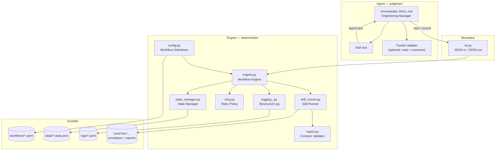
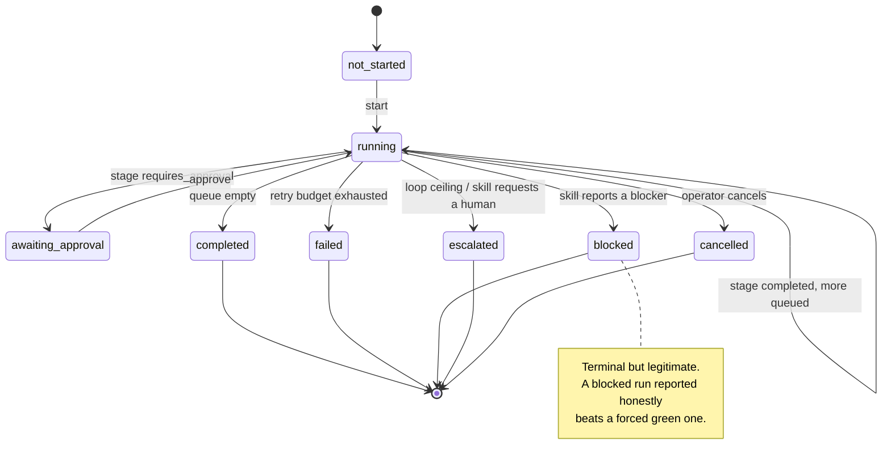
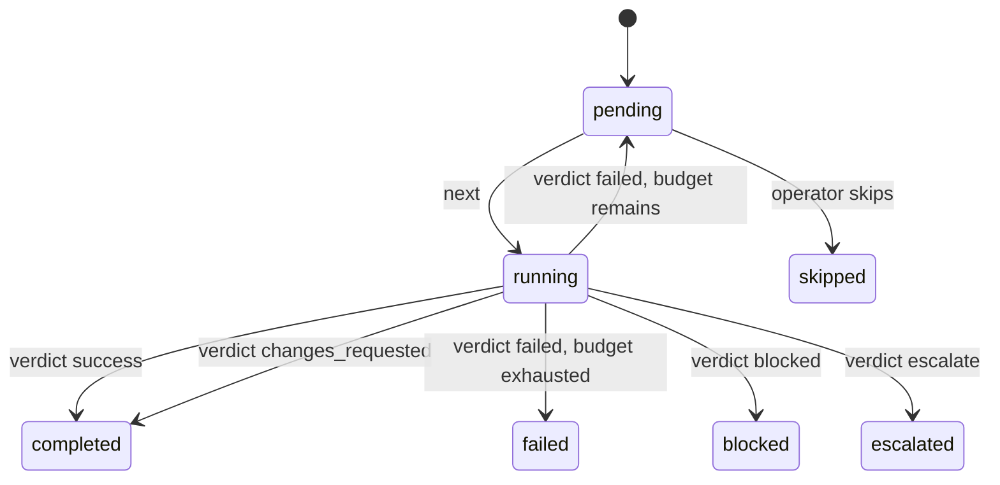
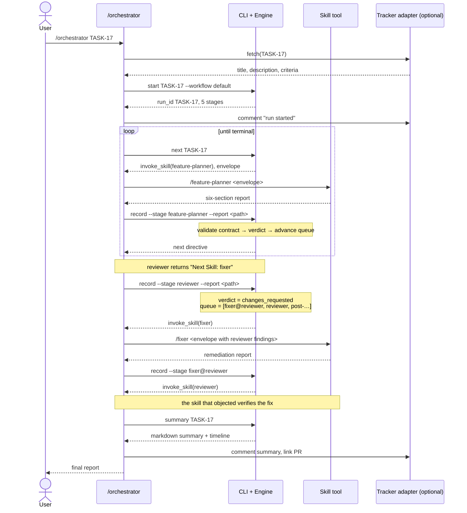

# Orchestrator Architecture

How the orchestration layer is built, and why it is built that way.

---

## 1. The central constraint

The orchestrator coordinates Claude Code skills. Skills are markdown operating
procedures executed by a model with repository context, tool permissions, and
judgment. **A Python process cannot execute one.**

That single fact determines the architecture. There are three ways to build
around it:

| Approach | Executes skills by | Cost |
| --- | --- | --- |
| Pure markdown | An agent following a written procedure | State, retries and resume are only as reliable as model discipline |
| Headless subprocess | `claude -p "/coding …"` per stage | Every stage is a cold session; repo context re-derived each time; output parsed from stdout |
| **Hybrid (chosen)** | The agent's Skill tool, sequenced by a deterministic engine | Requires an explicit contract between agent and engine |

The hybrid splits responsibility along the line of what each side is actually
good at:

- **Python owns what must be exact**: state persistence, attempt counting, retry
  budgets, loop ceilings, contract validation, structured logging, resume.
- **The agent owns what requires judgment**: reading a work item, invoking a
  skill, deciding whether output is genuine.

Neither can quietly take over the other's job. The engine cannot invoke a skill;
the agent cannot count attempts, because it never sees the counter.

---

## 2. Component map



### Dependency direction

```
models.py ← errors.py         (no dependencies — pure data)
    ↑
retry.py, report.py, yamlcompat.py, logging_.py
    ↑
config.py, state_manager.py, skill_runner.py
    ↑
engine.py
    ↑
cli.py
```

Strictly acyclic. `models.py` imports nothing but the standard library, which is
what lets every layer above it be tested without a filesystem.

---

## 3. Responsibilities

| Component | Owns | Explicitly does not |
| --- | --- | --- |
| **Workflow Engine** | Which stage runs next; how a verdict changes the queue; loop and runaway ceilings | Execute anything. Touch the filesystem directly. Know any skill's name. |
| **Skill Runner** | Skill discovery, metadata, envelope construction, report validation, verdict normalisation | Decide what happens after a verdict. |
| **State Manager** | Reading, mutating, and atomically persisting state; run identity; resume | Interpret workflow semantics. |
| **Retry Policy** | Whether a failed stage gets another attempt | Know what failed. |
| **Report Validator** | The six-section contract; extracting `Next Skill` | Judge report *quality*. |
| **Run Logger** | Append-only structured timeline | Influence control flow. |
| **Config** | Loading and validating workflow definitions and paths | Hold runtime state. |
| **CLI** | Translating commands into engine calls and results into JSON | Contain logic. |

The rule that keeps this honest: **no module contains a hardcoded skill name or
a hardcoded stage ordering.** Both live in `workflows/*.yaml`. Grep for
`"coding"` in `orchestrator/` and you will find it only in docstrings.

---

## 4. Lifecycle



Stage-level lifecycle:



---

## 5. The main sequence

A full run with one remediation cycle:



---

## 6. The agent/engine contract

Everything crossing the boundary is JSON. The agent never parses prose from the
engine, and the engine never parses prose from the agent — it only reads report
files, against a published contract.

**Engine → agent** (a directive):

```json
{
  "action": "invoke_skill",
  "run_id": "TASK-17",
  "stage_key": "fixer@reviewer",
  "skill": "fixer",
  "attempt": 1,
  "max_attempts": 2,
  "reason": "next stage in workflow 'default'",
  "envelope_path": "runs/TASK-17/fixer@reviewer/attempt-1.input.md",
  "report_path":  "runs/TASK-17/fixer@reviewer/attempt-1.report.md",
  "envelope": "## Objective\n\n…"
}
```

Four actions, and only four: `invoke_skill`, `await_approval`, `complete`,
`abort`. The agent's loop is a switch over these.

**Agent → engine**: a report file written verbatim, then `record`. The agent
supplies no interpretation — the engine derives the verdict itself from the
report's `# Next Skill` section. This is deliberate: if the agent could declare
"this succeeded", the contract validation would be advisory.

---

## 7. Why the loop is queue-based

A remediation cycle is not a retry, and conflating them is the classic mistake.

- A **retry** repeats a stage because the attempt was unusable — no progress was
  made. It consumes the stage's attempt budget.
- A **remediation cycle** is progress: the reviewer did its job correctly and
  found real defects. It consumes the *loop* budget, not the attempt budget.

Modelling both as "run it again" produces one of two failures: either a reviewer
that finds problems three times gets treated as broken and fails the run, or a
genuinely failing stage loops forever because each failure looks like progress.

The queue keeps them distinct:

```
queue: [reviewer, post-feature-implementation]

reviewer → changes_requested  (cycle 1 of 3)
queue: [fixer@reviewer, reviewer, post-feature-implementation]

fixer@reviewer → success
queue: [reviewer, post-feature-implementation]     reviewer reset to pending

reviewer → success
queue: [post-feature-implementation]
```

Both halves are queued when the loop opens, so `status` always shows the work the
run is actually committed to. The `fixer@reviewer` key namespaces the remediation
stage by its origin, so a later `fixer@security` cannot collide with it in state.

---

## 8. Design goals, and where they are enforced

| Goal | Enforced by |
| --- | --- |
| **Deterministic** | Engine is pure over (definition, state). No clocks or randomness in control flow. Same inputs → same directive. |
| **Recoverable** | State is the only source of truth, written atomically after every transition. Kill the process at any point; `next` resumes correctly. |
| **Composable** | Workflows are data. Stages compose without knowing each other; the only coupling is the report contract. |
| **Extensible** | Adding a skill is a directory plus a YAML line. `full-review.yaml` ships as the proof — it needs two skills that do not exist, and fails validation cleanly rather than crashing. |
| **Bounded** | Per-stage attempt budgets, per-loop cycle ceilings, and a global `max_total_stages` runaway guard. |
| **Auditable** | Every envelope and report persisted under `runs/`; every transition in the JSONL timeline. |
| **Zero-install** | Standard library only. No pip, no virtualenv, in a .NET + pnpm repository. |

---

## 9. Deliberate non-goals

- **No parallel stages.** The pipeline is inherently sequential — you cannot
  review code that is not written. Concurrency would add locking for no benefit.
- **No distributed execution.** One run, one machine, one state file. A run that
  needs a cluster is not a code review.
- **No conditional branching in workflow config.** No `if` expressions in YAML —
  that path ends in an untestable programming language embedded in a config file.
  Branching is expressed as separate workflow files.
- **No automatic work item state transitions.** Reading and commenting is safe;
  moving a real sprint item between columns is a human signal.

---

## 10. Test coverage

116 tests, standard-library `unittest`, no third-party dependencies:

```bash
python3 -m unittest discover -s tests -t tests
```

| Area | Covers |
| --- | --- |
| `test_report.py` | Six-section parsing, ordering, `Next Skill` extraction, verdict precedence |
| `test_engine.py` | Linear progression, remediation loops, escalation ceiling, retries, terminal states, approval gates |
| `test_state_manager.py` | Round-trip persistence, run-id normalisation, resume after interruption, corrupt and future-schema refusal |
| `test_config_and_runner.py` | YAML fallback parser, workflow validation, skill discovery, envelope construction, retry policy |
| `test_cli.py` | Full lifecycle through the CLI, exit codes, idempotent `next`, inspection commands |

The highest-value tests are the loop tests: `test_non_converging_loop_escalates_at_the_configured_ceiling`
and `test_exhausting_attempts_fails_the_run` are what stop a runaway from being
discovered on a real budget.
