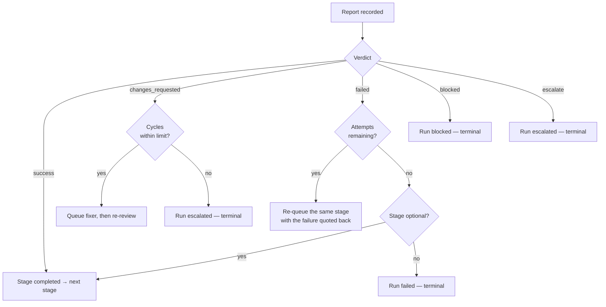

# Retry Policy and Error Handling

Retrying is a budget decision, not a reflex. Every retry spends real tokens and
real time, so the only question that matters is: **does another attempt have new
information to work with?**

---

## 1. Three governing rules

1. **Only recoverable failures are retried.** A missing `SKILL.md` or an invalid
   workflow fails identically on attempt three. Retrying wastes budget and buries
   the real error under noise.
2. **Every stage declares its own budget.** A planner that failed twice is
   under-specified — more attempts will not fix a bad input. A testing stage
   legitimately wants more, because each run produces new information.
3. **Remediation loops are counted separately from attempts.** `reviewer → fixer
   → reviewer` is not a retry; it is progress.

---

## 2. Retries vs remediation cycles

Conflating these is the classic orchestration mistake.

| | Retry | Remediation cycle |
| --- | --- | --- |
| Means | The attempt was unusable — no progress | The stage worked correctly and found real defects |
| Triggered by | `FAILED` | `CHANGES_REQUESTED` |
| Counter | `stage.attempts` | `stage.remediation_cycles` |
| Budget | `retry.max_attempts` | `remediation.max_cycles` |
| Exhaustion | Run `failed` | Run `escalated` |

Modelling both as "run it again" produces one of two failures: a reviewer that
finds problems three times gets treated as broken and fails the run, or a
genuinely failing stage loops forever because each failure looks like progress.

---

## 3. Verdicts and what they cause



---

## 4. Configuration

```yaml
- skill: coding
  retry:
    max_attempts: 3                    # default 2
    retry_on_contract_violation: true  # default true
    retry_on_blocked: false            # default false
  remediation:
    skill: fixer
    max_cycles: 3                      # default 3
```

| Option | Effect |
| --- | --- |
| `max_attempts` | Total attempts including the first. `1` means no retry. |
| `retry_on_contract_violation` | A malformed report is usually fixable by re-invoking with the violation quoted. Set `false` for a skill whose drift means something deeper is wrong. |
| `retry_on_blocked` | Off by default: a blocker means the skill needs something a retry cannot supply. |

### Shipped budgets

| Stage | Attempts | Cycles | Reasoning |
| --- | --- | --- | --- |
| `feature-planner` | 2 | — | Two failures means the input is under-specified; a human should look |
| `coding` | 3 | — | Benefits genuinely from a retry with the failure quoted back |
| `testing` | 4 | — | Each run produces new information |
| `reviewer` | 2 | 3 | Reviewing is near-deterministic; the real budget is the loop |
| `post-feature-implementation` | 2 | — | Mechanical; repeated failure means something upstream is wrong |

`max_cycles: 3` implements `shared/workflow-contract.md` §5 — "two full loops
without convergence is an escalation" — so the third cycle is the boundary.

---

## 5. Error taxonomy

```
OrchestratorError
├── RecoverableError          retry could plausibly help
│   └── ContractViolation     report does not conform to the contract
└── UnrecoverableError        retrying burns budget for nothing
    ├── ConfigError           invalid workflow definition
    ├── StateError            missing, corrupt, or future-schema state
    ├── SkillNotFoundError    no SKILL.md for a named skill
    └── WorkflowAborted       the run cannot continue
```

The recoverable/unrecoverable split is the one that matters — `RetryPolicy`
branches on exactly this distinction.

Every error surfaces through the CLI as JSON, never as a traceback:

```json
{
  "ok": false,
  "error": "workflow 'nope' not found in …/workflows. Available: default, full-review, hotfix, plan-only",
  "error_type": "ConfigError",
  "recoverable": false
}
```

Messages name the fix, not just the fault.

---

## 6. Terminal outcomes

Three of the five terminal states are **not** orchestrator failures. Reporting
them honestly is worth far more than forcing a green run.

| Status | Meaning | What the user needs |
| --- | --- | --- |
| `completed` | Queue drained successfully | The summary and the PR link |
| `failed` | A required stage exhausted its retries | The last error, and the smallest next step |
| `blocked` | A skill needs information nobody supplied | Exactly what is needed, and from whom |
| `escalated` | Loop ceiling hit, or a skill asked for a human | Both positions in the disagreement, stated plainly, with no verdict of the orchestrator's own |
| `cancelled` | Operator terminated the run | Confirmation and the state left behind |

Per contract §4: *guessing past a blocker is the most expensive available
failure.*

---

## 7. Bounding runaway execution

Three independent ceilings, because a single one always has a gap:

| Guard | Scope | Config |
| --- | --- | --- |
| `max_attempts` | One stage's retries | Per stage |
| `max_cycles` | One review loop | Per stage's remediation |
| `max_total_stages` | Total stage executions in the run | Per workflow (default 40) |

`max_total_stages` is the backstop. A misconfigured remediation loop — say two
stages that route to each other — would satisfy both per-stage budgets forever.
The global guard turns that into a clean abort with an explanatory reason instead
of an unbounded token spend.

---

## 8. Partial completion and resume

There is no "partial" status, and that is intentional — it would be a status that
means nothing actionable. Instead, a terminal run preserves exactly what was
achieved:

- Completed stages keep `completed` status, deliverables, decisions, and risks.
- Every report and envelope remains under `runs/<run-id>/`.
- `loom summary` reports what shipped *and* what did not.

To continue after resolving a blocker, re-run `loom next` — the queue was
cleared when the run terminated, so resuming a blocked run is a deliberate act:

```bash
loom start TASK-17 --force     # fresh run, prior artifacts retained on disk
```

`--force` is never used automatically. Restarting a failed run to get a cleaner
result destroys the evidence of why it failed.

---

## 9. Cancellation

```bash
loom cancel TASK-17 --reason "requirements changed"
```

Clears the queue, records the reason as an unrecoverable error, and marks the run
`cancelled`. In-flight work is not rolled back — files a skill has already
written stay written, because the orchestrator does not modify the repository and
will not start now. Cancellation stops the pipeline; reverting code is a git
operation the user performs deliberately.
