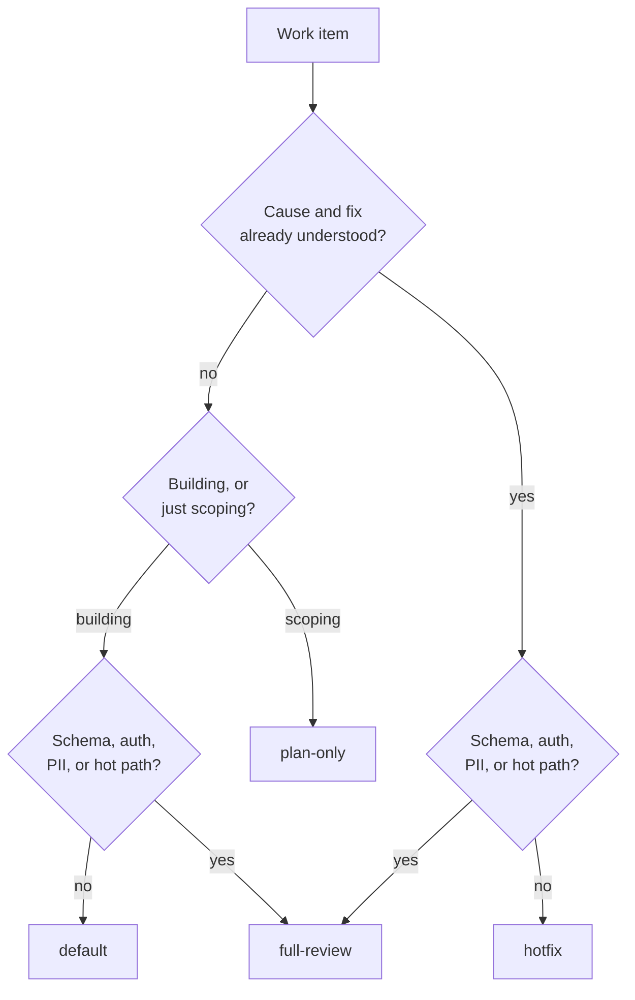

# Workflow Configuration

A workflow is a data file describing an ordered pipeline of skills. The engine
executes whatever it reads. **No skill name and no ordering appears anywhere in
the orchestrator's code** — that is what makes adding a stage a config change
rather than a code change.

---

## 1. Shipped workflows

| Workflow | Stages | Runnable today | Use for |
| --- | --- | --- | --- |
| `default` | planner → coding → testing → reviewer ⇄ fixer → PR | yes | Normal feature delivery |
| `hotfix` | coding → testing → reviewer ⇄ fixer → PR | yes | A defect with a known cause |
| `plan-only` | planner | yes | Scoping and estimation |
| `full-review` | + security, performance, approval gate | yes | Schema, auth, PII, hot paths |

```bash
lumos workflows --validate
```

`full-review` includes runnable security and performance checks, then pauses at
its declared human approval gate before PR creation.

---

## 2. Schema

```yaml
version: 1                    # schema version of this file
name: default                 # identity; defaults to the filename
description: …                # free text
max_total_stages: 40          # runaway guard — total stage executions per run

stages:
  - skill: reviewer           # required — must match a examples/skills/<name>/
    description: …            # shown in the directive's `reason`
    optional: false           # if true, failure does not fail the run
    requires_approval: false  # if true, the engine pauses before this stage
    retry:
      max_attempts: 2                    # default 2
      retry_on_contract_violation: true  # default true
      retry_on_blocked: false            # default false
    remediation:
      skill: fixer            # who fixes what this stage finds
      max_cycles: 3           # loop ceiling before escalation
```

Shorthand — a bare string is a stage with defaults:

```yaml
workflow:
  - feature-planner
  - coding
  - testing
```

`stages:` and `workflow:` are accepted interchangeably.

### Validation rules

| Rule | Rationale |
| --- | --- |
| At least one stage | An empty pipeline is a config error, not a no-op |
| No duplicate skill in one workflow | Stage keys must be unique in state |
| `remediation` requires `skill` | A loop with no target is unrunnable |
| `max_cycles ≥ 1`, `max_attempts ≥ 1` | Zero means "never run", which is what omitting the stage is for |
| `max_total_stages ≥ len(stages)` | The guard must not fire on a clean run |
| Every referenced skill must be invokable | Checked at `start`, before any tokens are spent |

---

## 3. Retry budgets

Budgets are deliberately **not uniform**. The question is always: *does another
attempt have new information to work with?*

| Stage | Attempts | Reasoning |
| --- | --- | --- |
| `feature-planner` | 2 | A plan that failed twice is under-specified. More attempts will not fix a bad input; a human should look. |
| `coding` | 3 | Genuinely benefits from a retry with the failure quoted back. |
| `testing` | 4 | Each run produces new information, so each retry is cheap and informative. |
| `reviewer` | 2 | Reviewing is near-deterministic. The real budget is `remediation.max_cycles`. |
| `post-feature-implementation` | 2 | Mostly mechanical; repeated failure means something upstream is wrong. |

Retries and remediation cycles are separate counters. See
[`retry-and-errors.md`](retry-and-errors.md).

---

## 4. Remediation loops

```yaml
- skill: reviewer
  remediation:
    skill: fixer
    max_cycles: 3
```

When `reviewer` reports `Next Skill: fixer`, the engine:

1. Increments `reviewer.remediation_cycles`
2. Queues `fixer@reviewer`, then `reviewer` again
3. Passes the reviewer's full findings to the fixer
4. On the fixer's success, returns to `reviewer` for verification

The skill that objected verifies the fix — the fixer never marks its own work as
accepted.

`max_cycles: 3` matches `shared/workflow-contract.md` §5: two full loops without
convergence is an escalation, so the third cycle is the boundary. Past it, the
run terminates as `escalated` with the disagreement recorded.

---

## 5. Manual approval gates

```yaml
- skill: post-feature-implementation
  requires_approval: true
```

The engine returns `await_approval` and stops. Nothing proceeds until:

```bash
lumos approve TASK-17 --stage post-feature-implementation
```

The orchestrator skill is explicitly forbidden from approving on the user's
behalf. Use gates before anything outward-facing or hard to reverse.

---

## 6. Optional stages

```yaml
- skill: performance
  optional: true
```

An optional stage that exhausts its retries is recorded as failed, and the run
continues. Use for advisory analysis whose absence should not block delivery —
never for `testing`, which Non-Negotiable Rule #1 makes mandatory.

---

## 7. Worked example: adding a security gate

Suppose `examples/skills/security/SKILL.md` now exists.

```yaml
# workflows/secure-delivery.yaml
version: 1
name: secure-delivery
description: Delivery with a dedicated security gate before the PR.
max_total_stages: 50

stages:
  - skill: feature-planner
    retry:
      max_attempts: 2

  - skill: coding
    retry:
      max_attempts: 3

  - skill: testing
    retry:
      max_attempts: 4

  - skill: reviewer
    retry:
      max_attempts: 2
    remediation:
      skill: fixer
      max_cycles: 3

  - skill: security
    description: Authorization, tenant isolation, injection surfaces, secrets.
    retry:
      max_attempts: 2
    remediation:
      skill: fixer
      max_cycles: 2

  - skill: post-feature-implementation
    requires_approval: true
    retry:
      max_attempts: 2
```

```bash
lumos validate secure-delivery
lumos start TASK-19 --workflow secure-delivery
```

No orchestrator code changed. That is the extensibility requirement, demonstrated
rather than asserted.

> **Block style only.** The bundled fallback YAML parser does not support inline
> flow collections (`retry: { max_attempts: 2 }`). It rejects them with an
> explicit message rather than mis-parsing, and `lumos validate` surfaces
> that immediately. Install PyYAML if you want flow style.

---

## 8. Choosing a workflow



When unsure, use `default`. Skipping the planner on work that is not genuinely
understood means nothing upstream catches a misdiagnosis.
